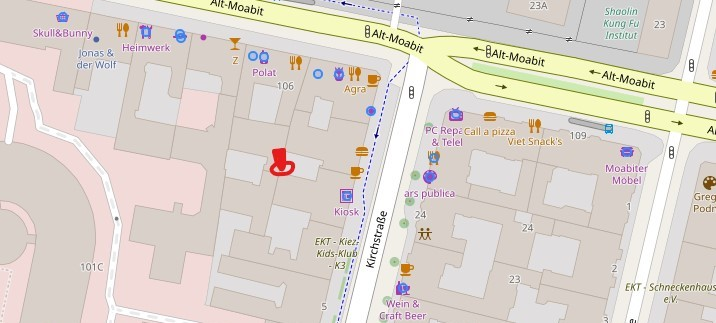
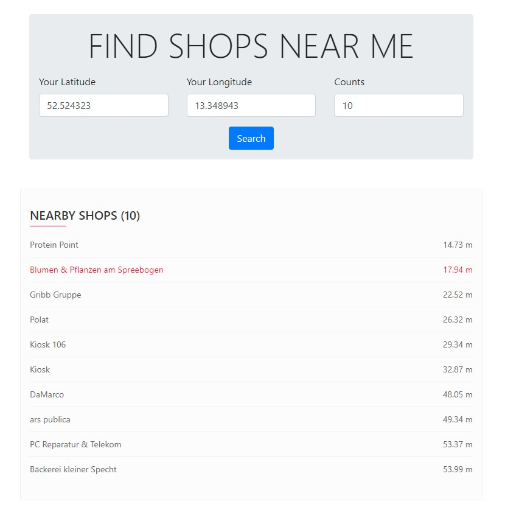

# Simple Shop Search Based on Django + PostGIS
Find shops near your location by Lat and Long input.


<br>


## Prerequisite
- Python 3
- GeoDjango dependencies (GEOS, GDAL, and PROJ.4)
- PostGIS

## Installation
Once you have all prerequisites installed, update `settings.py` with your PostGIS credentials.

Note: I assume you are using Windows, setting virtual environment will be different if you are using Mac or Linux.
Check [here](https://uoa-eresearch.github.io/eresearch-cookbook/recipe/2014/11/26/python-virtual-env) for virtual environment setup if you are not familiar.

```bash
$> git clone https://github.com/meandevstar/django-geo-search.git
$> cd django-geo-search
$> py -m venv env
$> .\env\Scripts\activate
$(env)> pip install -r requirements.txt
$(env)> py .\nearbyshops\manage.py migrate
$(env)> py .\nearbyshops\manage.py runserver
```

App will be up at http://localhost:8000
